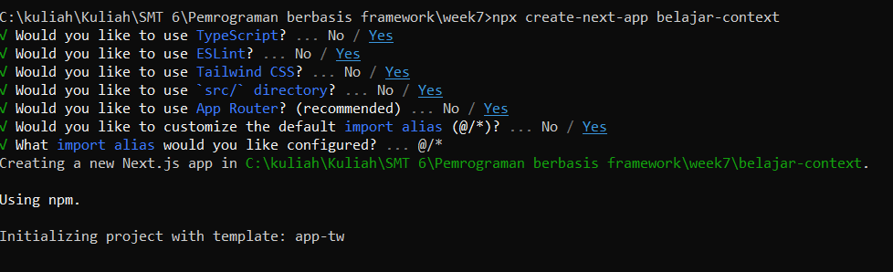
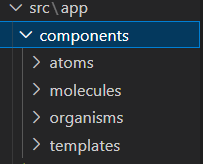
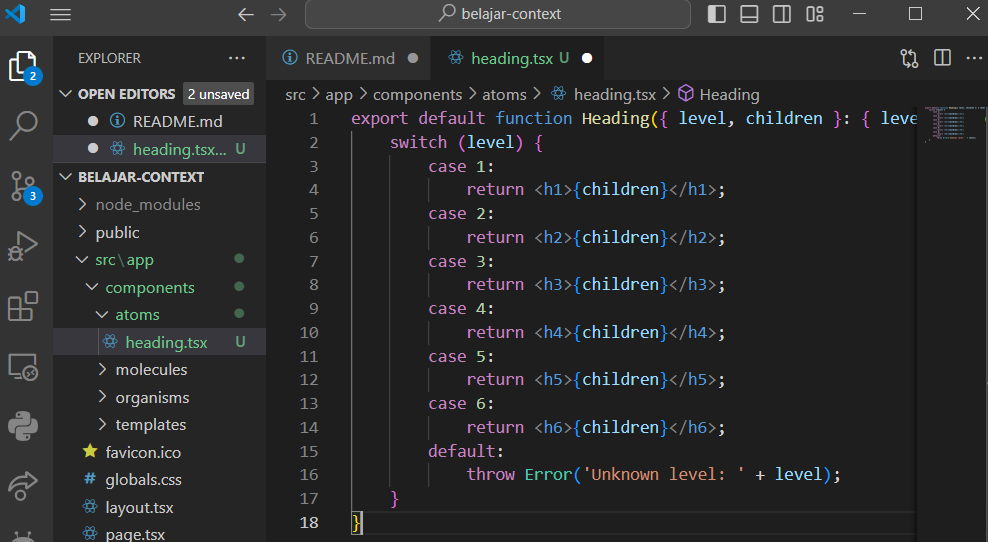
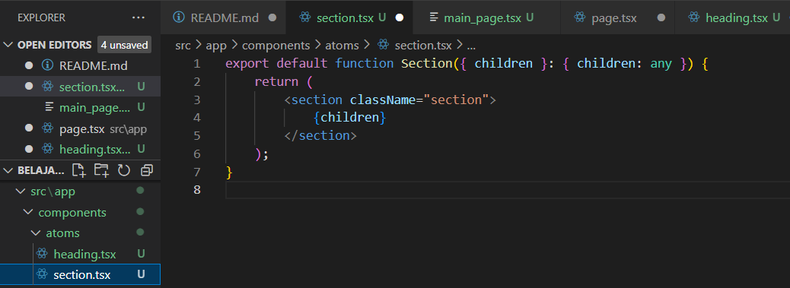

This is a [Next.js](https://nextjs.org/) project bootstrapped with [`create-next-app`](https://github.com/vercel/next.js/tree/canary/packages/create-next-app).

## Getting Started

First, run the development server:

```bash
npm run dev
# or
yarn dev
# or
pnpm dev
# or
bun dev
```

Open [http://localhost:3000](http://localhost:3000) with your browser to see the result.

You can start editing the page by modifying `pages/index.tsx`. The page auto-updates as you edit the file.

[API routes](https://nextjs.org/docs/api-routes/introduction) can be accessed on [http://localhost:3000/api/hello](http://localhost:3000/api/hello). This endpoint can be edited in `pages/api/hello.ts`.

The `pages/api` directory is mapped to `/api/*`. Files in this directory are treated as [API routes](https://nextjs.org/docs/api-routes/introduction) instead of React pages.

This project uses [`next/font`](https://nextjs.org/docs/basic-features/font-optimization) to automatically optimize and load Inter, a custom Google Font.

## Practical 1: Varying Heading Text Sizes with Context

Langkah 1: Buat project baru dan repo baru di GitHub
Silakan buat project baru seperti berikut dan repo baru dengan nama #07-belajar-context-nextjs


Langkah 2: Buat struktur folder dengan prinsip atomic design


Langkah 3: Buat komponen atom baru
Buat file baru di src/components/atoms/heading.tsx berisi kode sebagai berikut.


Kemudian buat file baru di src\components\atoms\section.tsx berisi kode berikut.


Lalu bagian MainPage buat file baru di src\components\templates\main_page.tsx berisi kode sebagai berikut.

Langkah 4: Ubah isi kode page.tsx dan run
Ubahlah kode di src\app\page.tsx seperti berikut. Lalu run dan lihat hasilnya di browser Anda.
